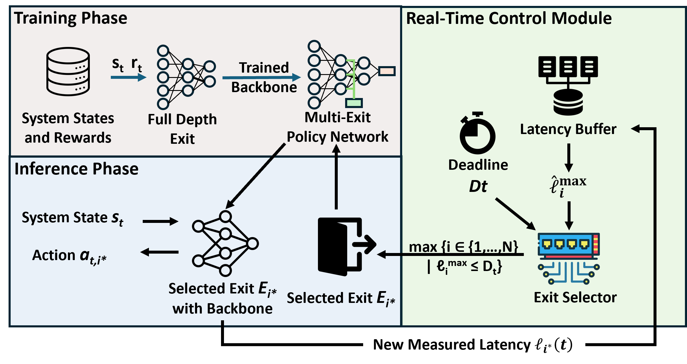
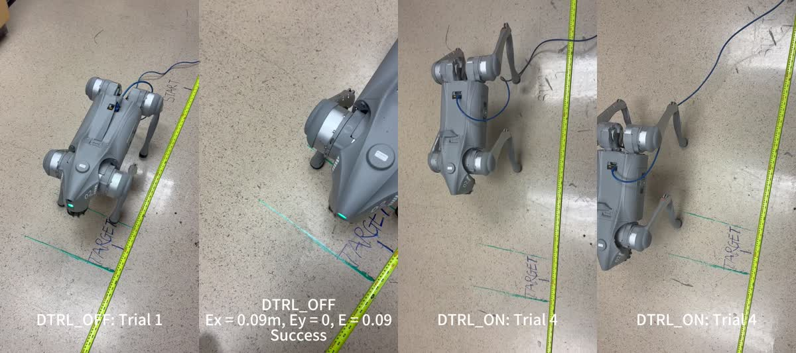

# DTRL: Reinforcement Learning Framework for Dynamic Time Requirements

Official implementation and evaluation artifact for **DTRL: Reinforcement
Learning Framework for Cyber-Physical Systems with Dynamic Time
Requirements** (RTSS 2026).

**Authors:** Yufeng Yang, Dacheng Shen, and Mengyu Liu  
School of Engineering and Applied Sciences, Washington State University
Tri-Cities

**[📄 Read the Paper](paper/DTRL_RTSS26.pdf)** ·
**[▶ Watch the Real-Robot Experiment](https://yufeng-yang.github.io/DTRL-RTSS26/real_robot.html)**

## RTSS 2026 oral presentation

We will present DTRL at the **47th IEEE Real-Time Systems Symposium (RTSS
2026)** in Yokohama, Japan, on **Thursday, December 10, from 11:00 to
12:30**. If you are attending RTSS 2026, we warmly invite you to join the
oral session and discuss the work with us.


## Overview



DTRL integrates early-exit policy networks into the control loop. At each
control step, a deterministic selector chooses the deepest exit whose online
latency estimate fits the current inference budget. The repository contains
the DTRL-On and DTRL-Off implementations, baseline implementations, trained
checkpoints, and scripts used to reproduce the paper's computational results.

## Real-robot experiment demo

The following video compares DTRL-On and DTRL-Off with the baseline methods on
the Unitree Go2 platform. Click the preview to watch the complete experiment.

[](https://yufeng-yang.github.io/DTRL-RTSS26/real_robot.html)

[▶ Watch the full real-robot experiment video](https://yufeng-yang.github.io/DTRL-RTSS26/real_robot.html)

## Repository contents

| Path | Description |
| --- | --- |
| `Quick_Artifact/` | Evaluation entry points for the reported tables and figures |
| `Src_Training/` | Training and task-specific evaluation code |
| `checkpoints/` | Released trained weights and provenance notes |
| `drawing/` | Plotting scripts for saved JSON and CSV results |
| `figure_and_table/` | Precomputed numerical results and rendered outputs |
| `environment/` | Tested Python dependency specifications |
| `third_party/` | Revisions needed for the Go2/FlashSAC experiments |
| `INSTRUCTIONS.md` | Full artifact reproduction guide |

Generated runs, replay buffers, virtual environments, and vendored copies of
third-party projects are intentionally excluded from GitHub.

## Quick start

The shortest reproduction path redraws the paper's results from the included
JSON and CSV files:

```bash
python -m venv .venv
source .venv/bin/activate
pip install -r environment/requirements.txt
export MPLBACKEND=Agg
python drawing/plot_all.py --no-show
```

The generated files are written to `figure_and_table/`.

## Re-evaluation

Evaluation dynamically profiles inference latency on the current hardware;
therefore, exact latency values can differ from those reported in the paper.
To rerun the Gym and Safety-Gymnasium tasks:

```bash
export DTRL_GYM_PY="$(command -v python)"
python Quick_Artifact/Table2_MainResults.py
```

The Unitree Go2 experiments use a separate Genesis/FlashSAC environment. Set
`DTRL_GO2_PY` to that environment's Python executable. See
[`INSTRUCTIONS.md`](INSTRUCTIONS.md) and
[`third_party/README.md`](third_party/README.md) for the complete setup.

## Training

List all supported training targets:

```bash
python train_artifact.py --list
```

For example, run the small Pendulum smoke configuration with:

```bash
python train_artifact.py --target pendulum-full --mode smoke
```

Full training runs can take several days depending on the task and hardware.

## Citation

```bibtex
@inproceedings{yang2026dtrl,
  title     = {DTRL: Reinforcement Learning Framework for Cyber-Physical
               Systems with Dynamic Time Requirements},
  author    = {Yang, Yufeng and Shen, Dacheng and Liu, Mengyu},
  booktitle = {Proceedings of the 47th IEEE Real-Time Systems Symposium},
  year      = {2026}
}
```

## License

No open-source license has been selected yet. Until a license is added, the
authors retain all rights to the repository contents. Third-party components
remain subject to their original licenses.
